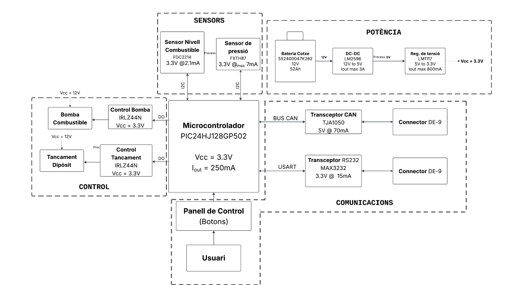

View this project on [CADLAB.io](https://cadlab.io/project/30195). 

# Projecte DJ_A_combustible

>**Autors: Edgar Castro i Pere Ribas
>**Versió: Final

----------

## Objectiu

Monitorització en temps real el nivell de combustible i les seves condicions (pressió/temperatura).

Control de la bomba de combustible i el tancament de seguretat de forma automàtica.

Bona connexió amb el vehicle per a que altres unitats de control tinguin accès a la informació.

## Diagrama de blocs

### Descripció/funcionalitat de cada bloc

  **Etapa 1, Alimentació**
  Etapa dedicada a protegir i alimentar tots els altres blocs del projecte.
  Primer els 12V seran protegits amb díodes, i aquests serviran per a la bomba del combustible i el tancament del dipòsit.
  A partir d'aqui baixarem a 3.3V que ens servirà per alimentar el nostre Micro.

  **Etapa 2, Control**
  Etapa destinada a ser el cervell del projecte.
  Trobem el micro, encarregat de rebre informació a través dels sensors, del CAN i del MAX3232, i de donar ordres ja siguin programades o especificades per l'usuari mitjançant els botons.
  Disposem també d'un conncetor per a la possible programació, de dos DE9 pels transceptors i d'un clock.
  També tenim la botonera per a controlar el tancament del dipòsit i la bomba de combustible.

  **Etapa 3, Potència**
 Etapa destinada a controlar mitjançant dos MOSFETs els motors de la Bomba de Combustible i el Tancament del Dipòsit.
 A més per a major protecció s'han afegit dos relés i dos díodes pels sobrepics de tensió.

  **Etapa 4, Sensors**
 Etapa on hi han els sensors de nivell de combustible FDC2214 i el sensor de pressió dels pneumàtics FXTH87 amb les connexions adequades.

-----------

## Requisits / Especificacions

  * Alimentació; 12V, regulada 5V i 3.3V
  * Microcontrolador PIC24HJ128GP502
  * Mòdul RF Receptor
  * Sensor de Combustible: FDC2214
    
  ### Regles de disseny 
  * Marge mínim: 0.2mm
  * Amplada mínima de la pista: 0.1mm
  * Amplada mínima de conenxionat: 0.2mm
  * Marge de cobre a forat: 0.25mm
  * Diàmetre mínim de uVia: 0.25mm
  * Orifici mínim de uVia: 0.15mm
  * Modificacions de la serigrafia

**Classes de nodes i amplada**
  * GND → 0.2mm
  * GND_PWR → 0.5mm
  * Alimentació → 0.5mm
  * 5V → 0.3mm
  * 3.3V → 0.2mm
  * Default → 0.25mm

-----------

## Components

| Descripció | Ref | Package | Datasheet | Proveïdor | Preu Unitari | Unitats |
| --- | --- | --- | --- | --- | --- | --- |
| **Microcontrolador PIC24 (16-bit)** | U20 | SOIC-28W | [Datasheet](http://ww1.microchip.com/downloads/en/DeviceDoc/70293G.pdf) | [Mouser](https://www.mouser.es/ProductDetail/Microchip-Technology/PIC24HJ128GP502-I-SO?qs=Fllw7YelV39GXmNd3htPpg%3D%3D) | 5,86€ | 1x |
| **Mòdul RF Receptor** | XY-MK-5V | - | [Datasheet](https://www.berrybase.ch/en/product-datasheet/019234a3d36272808ea5c21625235fe6/create) | [Digikey](https://www.digikey.es) | 4,95€ | 1x |
| **Sensor Capacitiu (Combustible)** | U6 | QFN-16 | [Datasheet](https://www.ti.com/lit/ds/symlink/fdc2214.pdf) | [Mouser](https://www.mouser.es/ProductDetail/Texas-Instruments/FDC2214RGHR?qs=GJ%2F2ZGcr5uPBUC9HQa0OnA%3D%3D) | 5,38€ | 1x |
| **Relé SPST-NO (6A)** | K1, K2 | Vertical THT | [Datasheet](https://www.fujitsu.com/sg/imagesgig5/ftr-ly.pdf) | [Digikey](https://www.digikey.es) | 1,49€ | 2x |
| **MOSFET N-Channel** | Q1, Q2 | TO-220F-3 | [Datasheet](http://www.irf.com/product-info/datasheets/data/irliz44n.pdf) | [Digikey](https://www.digikey.es) | 1,29€ | 2x |
| **Regulador Step-Down 12V** | U1 | TO-263-5 | [Datasheet](http://www.ti.com/lit/ds/symlink/lm2596.pdf) | [Digikey](https://www.digikey.es) | 6,18€ | 1x |
| **Regulador LDO 3.3V** | U2 | TO-252-3 | [Datasheet](http://www.ti.com/lit/ds/symlink/lm1117.pdf) | [Digikey](https://www.digikey.es) | 1,15€ | 1x |
| **Transceptor CAN** | U3 | SOIC-8 | [Datasheet](http://www.ti.com/lit/ds/symlink/sn65hvd230.pdf) | [Digikey](https://www.digikey.es) | 1,94€ | 1x |
| **Driver RS232** | U4 | SOIC-16 | [Datasheet](https://datasheets.maximintegrated.com/en/ds/MAX3222-MAX3241.pdf) | [Digikey](https://www.digikey.es) | 1,91€ | 1x |
| **Díode Rectificador (Flyback)** | D_p_bomba1, 2 | DO-41 THT | [Datasheet](http://www.vishay.com/docs/88503/1n4001.pdf) | [Digikey](https://www.digikey.es) | 0,18€ | 2x |
| **Díode Schottky (DCDC)** | D_schottky1 | D_SMA | [Datasheet](https://ww1.microchip.com/downloads/aemdocuments/documents/HRDS/ProductDocuments/DataSheets/1n5823-25.pdf) | [Digikey](https://www.digikey.es) | 0,88€ | 1x |
| **Díode Zener 14V** | D_Zener1 | D_SOD-123 | [Datasheet](https://www.mouser.es/datasheet/3/225/1/SMBJ5338B-SMBJ5388B(SMB).pdf) | [Digikey](https://www.digikey.es) | 0,17€ | 1x |
| **Díode Protecció (MBR0520)** | D_Proteccio1 | D_SOD-123 | [Datasheet](http://www.mccsemi.com/up_pdf/MBR0520~MBR0580(SOD123).pdf) | [Digikey](https://www.digikey.es) | 0,12€ | 1x |
| **Cristall de Quars** | Y1 | SMD 5032-2 | [Datasheet](https://www.mouser.es/datasheet/3/294/1/ecx_53r.pdf) | [Digikey](https://www.digikey.es) | 0,59€ | 1x |
| **Pulsadors (Slide/DIP)** | SW1, SW2, SW3 | SMD DIP | [Datasheet](https://www.mouser.es/datasheet/3/6118/1/slw-166261-4a-ra-n-d.pdf) | [Digikey](https://www.digikey.es) | 0,95€ | 3x |
| **Connector DB9 (RS232)** | J1, J2 | DSUB-9 | [Datasheet](https://www.mouser.es/datasheet/3/59/2/CN_DSUB9SKT00.pdf) | [Mouser](https://www.mouser.es) | 23,48€ | 2x |
| **Connectors Bomba/Tancament** | J4, B1, T1 | Pin 1x02 | [Datasheet](https://www.we-online.com/components/products/datasheet/61300211121.pdf) | [Digikey](https://www.digikey.es) | 0,11€ | 3x |
| **Connector Prog. PIC (ICSP)** | J3 | Pin 1x05 | [Datasheet](https://www.we-online.com/components/products/datasheet/61300211121.pdf) | [Digikey](https://www.digikey.es) | 0,22€ | 1x |
| **Connector Prog. Sensor (BKGD)** | J5 | Pin 1x04 | [Datasheet](https://www.we-online.com/components/products/datasheet/61300211121.pdf) | [Digikey](https://www.digikey.es) | 0,16€ | 1x |
| **Inductor 33uH (DCDC)** | L_DCDC1 | SRP7028A | [Datasheet](https://www.bourns.com/docs/product-datasheets/srp7028a.pdf) | [Digikey](https://www.digikey.es) | 0,94€ | 1x |
| **Inductor 18uH (Filtre)** | L1 | L_0805 | [Datasheet](https://product.tdk.com/system/files/dam/doc/product/inductor/inductor/smd/catalog/inductor_commercial_decoupling_mlz2012_en.pdf) | [Digikey](https://www.digikey.es) | 0,11€ | 1x |
| **Ferrite Bead** | FB1 | L_1812 | [Datasheet](https://www.we-online.com/components/products/datasheet/7427922.pdf) | [Digikey](https://www.digikey.es) | 0,25€ | 1x |
| **Condensador 680uF** | Cin_DCDC1 | Radial D10mm | [Datasheet](https://industrial.panasonic.com/cdbs/www-data/pdf/RDF0000/ABA0000C1259.pdf) | [Digikey](https://www.digikey.es) | 0,93€ | 1x |
| **Condensador 220uF** | Cout_DCDC1 | Radial D10mm | [Datasheet](https://industrial.panasonic.com/cdbs/www-data/pdf/RDF0000/ABA0000C1259.pdf) | [Digikey](https://www.digikey.es) | 0,61€ | 1x |
| **Condensador 100uF** | Cout_reg1 | Radial D5mm | [Datasheet](https://industrial.panasonic.com/cdbs/www-data/pdf/RDF0000/ABA0000C1259.pdf) | [Digikey](https://www.digikey.es) | 0,33€ | 1x |
| **Condensadors 10uF** | C7, Cin_reg1 | C_0805 | [Datasheet](https://datasheets.kyocera-avx.com/AutoMLCC.pdf) | [Digikey](https://www.digikey.es) | 0,14€ | 2x |
| **Condensadors 100nF** | C1-C9, C32-33 | C_0805 | [Datasheet](https://datasheets.kyocera-avx.com/AutoMLCC.pdf) | [Digikey](https://www.digikey.es) | 0,08€ | 10x |
| **Condensadors 22p** | C10, C11 | C_0805 | [Datasheet](https://datasheets.kyocera-avx.com/AutoMLCC.pdf) | [Digikey](https://www.digikey.es) | 0,08€ | 2x |
| **Condensador 33p** | C20 | C_0805 | [Datasheet](https://datasheets.kyocera-avx.com/AutoMLCC.pdf) | [Digikey](https://www.digikey.es) | 1,04€ | 1x |
| **Resistència 10k** | R1-R21 (varies) | R_0805 | [Datasheet](https://www.vishay.com/docs/20035/dcrcwe3.pdf) | [Digikey](https://www.digikey.es) | 0,08€ | 4x |
| **Resistència 4.7k** | R3, R4 | R_0805 | [Datasheet](https://www.vishay.com/docs/20035/dcrcwe3.pdf) | [Digikey](https://www.digikey.es) | 0,08€ | 2x |
| **Resistència 220** | R22, R23 | R_0805 | [Datasheet](https://www.vishay.com/docs/20035/dcrcwe3.pdf) | [Digikey](https://www.digikey.es) | 0,16€ | 2x |
| **Resistència 120 (CAN)** | R_CAN1 | R_0805 | [Datasheet](https://www.vishay.com/docs/20035/dcrcwe3.pdf) | [Digikey](https://www.digikey.es) | 0,08€ | 1x |

-----------

## Software

### Eines:

  * KiCad 9.0 o superior
  * LTspice
  * Lucid

### Funcionalitats:

  * El tancament i obertura del tanc de combustible
  * L'activació de la bomba que subministra el combustible al motor del vehicle
  * Captar informació sobre el nivell de combustible a través d'un sensor digital per a comunicar amb l'usuari
  * Mesurar activament la pressió dels pneumàtics del cotxe. En aquest cas, amb un receptor RF es reben les dades captades per un sensor de pressió (el sensor no forma part del projecte ja que físicament no té sentit que sigui a la pcb, sinó aprop del pneumàtic).
  * Comunicar tota aquesta informació a l'usuari del vehicle i a tot el vehcile en sí a través de diferents mètodes d'enviament de dades (UART i CAN).  

-----------

## Historial de canvis
### 15/03/2026
Hem millorat el diagrama de blocs, tant l'etapa 1 com la 3.
A més he fet que les fletxes siguin més gruixudes per tal que es vegin millor.
Al KiCad he obert l'esquemàtic i he **creat els subesquemàtics**, en els quals només he posat els noms de les etapes 1 i 3.
I he fet una **carpeta** per anar posant les millores dels **diagràmes de **blocs**.
Realment del diagrama de blocs només quedaria posar el **nom i especificacions generals dels components que falten**,  acabar de modificar una mical del **disseny del diagrama** i ja estaria acabat.

### 19/03/2026
Hem millorat el diagrama de blocs, amb les correccions dels professors.
També hem començat la part esquemàtica de les diferents etapes a KiCad. En general, s'ha avançat gran part, quedarien connectar pocs pins i definir-los correctament, entendre bé el funcionament i les correccions del professor. 
A més, també haurem de millorar l'organització dels subesquemàtics creats a la carpeta compartida per tal d'aquesta manera tenir una millor visualització i entendre les etapes millor. 
Properament haurem de assignar valors als diferents components i optimitzar algun circuit

### 22/03/2026
S'ha *finalitzat definitivament el diagram de blocs*.
A l'etapa de control s'ha **afegit** un **relé** per a major **protecció** per al microcontrolador degut a les grans càrregues i potències que pot comportar el funcionament de la bomba i el tancament.
S'ha **afegit** el símbol del sensor de combustible **FDC2214**, falta **crear** el símbol del sensor de pressió **FXTH87**

### 24/03/2026
A dia d'avui, en principi no queda pràcticament res (de la part de l'esquemàtic). S'ha avançat gran part del que ens vam proposar en la darrera sessió de pràctiques, com la forma dels pins, afegir els pins que faltaven, els valors dels components, etc., juntament amb les correccions del professor. A banda d'això, també s'ha afegit una part de programació ICSP per a que l'usuari pugui controlar al seu gust mitjançant un connector extern del propi usuari al microcontrolador. 
A la tarda d'avui, només queda (de moment) crear el símbol del sensor de pressió i connectar els pins corresponents.

### 25/03/2026
**Esquemàtic acabat** abans de l'última sessió (a falta de les correccions que es faràn demà a classe).
S'ha continuat fent el Readme on s'han anat emplenant diferents apartats.
A banda d'això s'hauria d'**anar triant les petjades**, sobretot pels símbols que hem creat nosaltres o els que no estem acostumats a treballar, ja que per components passius o que ja hem tocat, les petjades suposem que seran les mateixes i que no les haurem de crear ni afegir al KiCad

### 29/03/2026
La **majoria de petjades s'han afegit**. Tots els components que no son resistències o capacitats ja tenen **petjada**.
Falta **mirar** els **pins FXTH87** ja que els pins possiblement estiguin **mal posats** i el **footprint no coincideixi** i falta repassar el propi datasheet per saber quin footprint triar.
*Altres footprints que falten:*
Cristall
Connectors 1x2 i 1x5
Díodes
Bobines
Resistències i Capacitats
També s'hauràn d'afegir les petjades i datasheets al README

### 04/04/2026
**Totes les petjades afegides**
Sensor de pressió acabat
Falta posar les petjades al readme
**Esquemàtic acabat (en teoria)**

### 08/04/2026
**Placement V1**, falta posar tots els components passius, però com és un placement i a sobre quasi al 100% s'haurà de canviar una mica, posar aquests components és perdre el temps.
Hem començat també a posar els proveïdors i els preus a la llista del Readme i s'ha actualitzat la foto per a que es vegi

### 15/04/2026
Començament del ruteig

### 16/04/2026
Modificació correccions per part del professorat. Afegim captures de diferents versions de del routing (ERC amb 0 errors). Faltaria veure si hi ha alguna cosa a corregir i passar a la part final del projecte.

### 29/04/2026
Últims retocs al esquemàtic i al layout. S'ha fet la presentació, final, s'han afegit els gerbers, BOM, fotos 3D del layout final i fotos de l'esquemàtic.
Pressupost fet i afegida la carpeta del pressupost al projecte.
**Falta acabar el readme, la taula de components**

### 30/04/2026
Tot preparat (des de ahir). Presentació realitzada amb el procès d'aquest projecte. Nervis d'últim dia, però està controlat!
